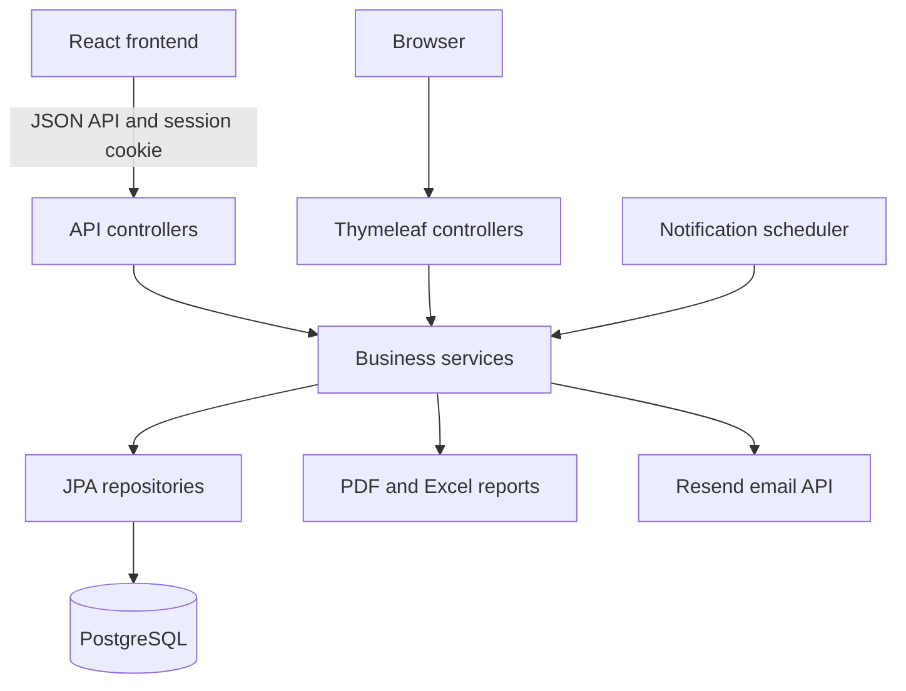

# Charity Management System


**Manage a charity's people, activities, and finances in one place.**

A full-stack application with a React frontend, a Spring Boot backend, and PostgreSQL storage. It brings members, donations, projects, events, annual dues, and financial reports into a shared workspace organized by year. The repository also retains its Thymeleaf interface.

[Features](#features) · [Architecture](#architecture) · [Quick start](#quick-start) · [Configuration](#configuration) · [Docker](#docker) · [Development](#development) · [Documentation](#documentation)

## Features

| Area | What readers can expect |
| --- | --- |
| Dashboard | Overview of members, activities, and financial totals, with navigation to each module. |
| Members | Manage member records, roles, assignments, and profiles; search, filter, and paginate records. |
| Donations | Record donations, associate members, and organize contributions by year. |
| Projects and events | Manage activities, participating members, project progress, and event tasks. |
| Budgets and years | Group records by year and review budgets and financial summaries. |
| Membership dues | Record annual payments, set yearly fees, and retain receipt history. |
| Reports | Export PDF and Excel reports, including yearly financial information. |
| Notifications | In-app alerts, scheduled event reminders, and optional email delivery through Resend. |
| Public page | Present published completed projects and upcoming events. |
| Access control | Session authentication, BCrypt password hashing, CSRF protection, and role-based permissions. |

### How the workspace fits together

1. **Choose a year** to organize the charity's activities and finances.
2. **Manage people and activities** through member, donation, project, and event records.
3. **Record financial activity** through budgets and membership receipts.
4. **Review and share results** using the dashboard and exported reports.

### Roles and membership

The application defines nine roles: `HEAD`, `SUBHEAD`, `TREASURER`, `EVENT_MANAGER`, `PROJECT_MANAGER`, `VOLUNTEER`, `MEMBER`, `DONOR`, and `SPONSOR`. Available pages and actions depend on backend authorization rules; not every role can edit every module.

**Annual membership payment status is separate from an account's permission role.** Paying dues does not grant administrative access.

<details>
<summary><strong>How annual membership receipts work</strong></summary>

- `HEAD`, `SUBHEAD`, and `TREASURER` can record received payments and set the fee for a past, current, or future coverage year. The default fee is EUR 10.00.
- Payments are recorded offline; this feature does not process card charges.
- The members list shows payment status for the selected year, and profiles show personal payment history. A missing receipt means no payment is recorded, not an automatically calculated debt.
- Fee changes affect new receipts. To correct an existing receipt, void it with a reason and record a replacement.
- Receipt name snapshots and payment history survive member deletion. A database constraint prevents duplicate active receipts for the same member and year.
- Membership income appears in the dashboard, yearly summary, and complete-year PDF. It uses a separate ledger from donations, so the same income should not be entered twice.

</details>

## Architecture



Both interfaces share backend services and persistence. Spring Security controls access, DTOs shape API responses, and validation and exception handling support the request flow. API authentication uses a server session cookie and CSRF tokens.

| Layer | Technologies |
| --- | --- |
| Backend | Java 17, Spring Boot 4.0.3, Spring MVC, Spring Security |
| Persistence | Spring Data JPA, Hibernate, PostgreSQL |
| Frontend | React, React Router, Vite; retained Thymeleaf templates and Bootstrap styles |
| Reporting | OpenPDF, Apache POI |
| Email | Resend Java SDK |
| Build and packaging | Maven Wrapper, npm, multi-stage Docker build |

## Quick start

### 1. Install prerequisites and clone

- **JDK 17** with `JAVA_HOME` configured.
- **PostgreSQL** with an existing database and a user allowed to create/update its tables.
- **Node.js 22.12 or later in the 22.x series** and npm for the React frontend.
- **Git**. Maven is provided through the repository's wrapper.

```bash
git clone https://github.com/fejmiqaz/Charity-Management-System.git
cd Charity-Management-System
```

### 2. Configure and start the backend

Set the following environment variables in the terminal that starts Spring Boot. Replace the example database credentials and administrator password with your own values.

**PowerShell (Windows)**

```powershell
$env:DATABASE_URL = 'jdbc:postgresql://localhost:5432/charity_management'
$env:DATABASE_USERNAME = 'charity_user'
$env:DATABASE_PASSWORD = 'replace-with-database-password'
$env:ADMIN_EMAIL = 'admin@example.com'
$env:ADMIN_PASSWORD = 'replace-with-a-strong-password'
$env:API_ALLOWED_ORIGINS = 'http://localhost:5173'
.\mvnw.cmd spring-boot:run
```

<details>
<summary><strong>Bash (Linux / macOS)</strong></summary>

```bash
export DATABASE_URL='jdbc:postgresql://localhost:5432/charity_management'
export DATABASE_USERNAME='charity_user'
export DATABASE_PASSWORD='replace-with-database-password'
export ADMIN_EMAIL='admin@example.com'
export ADMIN_PASSWORD='replace-with-a-strong-password'
export API_ALLOWED_ORIGINS='http://localhost:5173'
./mvnw spring-boot:run
```

If the wrapper is not executable, run `chmod +x mvnw` first.

</details>

The backend runs at [localhost:8080](http://localhost:8080). On startup, it creates a `HEAD` account for `ADMIN_EMAIL` if that email does not already exist. Changing the bootstrap password later does not reset an existing account's password.

The current `spring.jpa.hibernate.ddl-auto=update` setting creates or updates application tables; it does not create the PostgreSQL database itself. Supply backend variables through your shell, IDE, or deployment environment; a root `.env` file is not automatically loaded by this setup.

### 3. Start the React frontend

Open a second terminal at the repository root:

```bash
cd frontend
npm ci
npm run dev -- --port 5173 --strictPort
```

Before starting Vite, ensure `frontend/.env` contains the local API address shown in [frontend/.env.example](frontend/.env.example):

```dotenv
VITE_API_BASE_URL=http://localhost:8080
```

Open [localhost:5173](http://localhost:5173) and sign in with the administrator email and password configured above. Keep both terminals running. Use `localhost` consistently so the browser's session behavior matches the configured origin.

> **Backend-only option:** Skip the frontend steps to use the retained Thymeleaf pages at port 8080. React routing is enabled in the Docker image, which bundles the compiled frontend.

## Configuration

Backend settings are defined in [application.properties](src/main/resources/application.properties).

| Environment variable | Default | Purpose |
| --- | --- | --- |
| `DATABASE_URL` | Required | PostgreSQL JDBC connection URL. |
| `DATABASE_USERNAME` | Required | Database username. |
| `DATABASE_PASSWORD` | Required | Database password. |
| `ADMIN_EMAIL` | Required | Email for the initial administrator account. |
| `ADMIN_PASSWORD` | Required | Password used when creating that account. |
| `ADMIN_NAME` | `System Administrator` | Initial administrator display name. |
| `API_ALLOWED_ORIGINS` | Empty | Exact frontend origins, comma-separated; empty allows same-origin only. |
| `PUBLIC_TIME_ZONE` | `Europe/Skopje` | Time zone for public dates and reminder calculations. |
| `MEMBERSHIP_DEFAULT_FEE` | `10.00` | Default annual dues; individual years can override it. |
| `NOTIFICATIONS_SCHEDULING_ENABLED` | `true` | Enables scheduled notification processing. |
| `NOTIFICATIONS_EMAIL_ENABLED` | `false` | Enables actual email delivery. |
| `NOTIFICATIONS_FROM` | Empty | Sender address for notification emails. |
| `RESEND_API_KEY` | Empty | Credential for the Resend HTTPS API. |
| `APP_BASE_URL` | Empty | Public application URL used in email links. |
| `RATE_LIMIT_TRUST_PROXY` | `false` | Uses forwarded client addresses when behind a trusted proxy. |

### Notifications

In-app notifications work with email delivery disabled. To deliver email, set `NOTIFICATIONS_EMAIL_ENABLED=true` and configure `RESEND_API_KEY`, `NOTIFICATIONS_FROM`, and `APP_BASE_URL`. The current delivery service uses Resend's HTTPS API.

| Scheduled job | Configured delay | Property |
| --- | --- | --- |
| Pending email delivery | 5 minutes | `app.notifications.email-delay-ms=300000` |
| Event reminder scan | 15 minutes | `app.notifications.reminder-delay-ms=900000` |

Both jobs default to a 60-second initial delay. These are fixed delays after the previous run completes, and the application must remain running for them to execute. Event reminders cover 21, 7, and 1 calendar days before the event.

### Request limits and logs

Per client address, the application allows 300 total requests, 10 login attempts, 5 registrations, and 60 data-changing requests per minute. Excess requests receive HTTP `429` with a `Retry-After` header. Limits are stored in memory, apply per instance, and reset on restart.

Enable `RATE_LIMIT_TRUST_PROXY` only when the application is reachable exclusively through a trusted proxy that sets `X-Forwarded-For`. Application logs are written to `logs/charity-management.log`, with rolling files configured in the application properties.

## Docker

The [Dockerfile](Dockerfile) builds React, copies its output into Spring Boot's static resources, and packages both in a Java 17 runtime image. React routing is enabled with `APP_FRONTEND_REACT=true`; production API requests use the same origin.

```bash
docker build -t charity-management-system .
docker run --rm -p 8080:8080 --env-file /path/to/charity.env charity-management-system
```

Create the environment file outside the repository with the required variables from the configuration table, using `KEY=value` lines. The database URL must point to PostgreSQL reachable from the container; `localhost` inside the container refers to the container itself.

Open [localhost:8080](http://localhost:8080). The image contains the application only; PostgreSQL must run separately.

## Development

### Repository layout

```text
Charity-Management-System/
├── frontend/
│   ├── src/                 # React pages, components, contexts, and styles
│   ├── tests/               # Frontend API and localization tests
│   └── package.json         # Development, build, and validation scripts
├── src/
│   ├── main/
│   │   ├── java/emd/charitymanagementsystem/
│   │   │   ├── Api/         # JSON API controllers
│   │   │   ├── Config/      # Security, initialization, and app configuration
│   │   │   ├── DTO/         # Request and response objects
│   │   │   ├── Mapper/      # Entity/DTO conversion
│   │   │   ├── Models/      # Entities and domain types
│   │   │   ├── Repository/  # Persistence interfaces
│   │   │   ├── Security/    # Authentication support
│   │   │   ├── Service/     # Business logic and implementations
│   │   │   └── Web/         # Thymeleaf and export controllers
│   │   └── resources/
│   │       ├── static/      # Static web assets
│   │       ├── templates/   # Thymeleaf views
│   │       └── application.properties
│   └── test/                # Backend tests
├── docs/                    # Feature and API documentation
├── Dockerfile
├── pom.xml
└── mvnw / mvnw.cmd          # Maven Wrapper
```

### Build and validate

Run backend commands from the repository root with the required backend environment configured. On Linux/macOS, replace `.\mvnw.cmd` with `./mvnw`.

```powershell
.\mvnw.cmd test
.\mvnw.cmd clean package
```

Backend tests cover areas including authorization, membership receipts, notifications, reports, budgeting, and API behavior. Some tests supply their own database settings; the general application context test uses the configured environment. Use a dedicated development/test database.

Run frontend checks from `frontend/`:

```bash
npm test
npm run lint
npm run check:i18n
npm run build
```

The frontend build writes to `frontend/dist`; Maven alone does not bundle that output. Use the Docker build above to package both interfaces' assets with the backend.

## Documentation

| Reference | Contents |
| --- | --- |
| [JSON API](docs/api.md) | Endpoints, session cookies, CSRF tokens, and frontend origin configuration. |
| [Exports and budget impact](docs/exports-budget-impact.md) | Reporting and financial behavior. |
| [Public front page](docs/public-front-page.md) | Public project and event presentation. |
| [Notification behavior](docs/notifications.md) | Inbox behavior, event milestones, and deduplication. Its older SMTP setup section is superseded by the Resend configuration above. |
| [Application configuration](src/main/resources/application.properties) | Backend defaults and environment bindings. |
| [Frontend scripts](frontend/package.json) | Available development and validation commands. |
